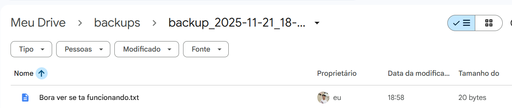

# Backup Incremental em Python

Este projeto contém um script em Python que realiza backup incremental de uma pasta local para um diretório sincronizado com Google Drive Desktop (ou qualquer outra solução de nuvem baseada em pasta local).

O backup incremental copia apenas arquivos novos ou modificados desde o último backup, economizando tempo e espaço.

---

## Como funciona

1. O script lê os caminhos definidos no arquivo `config.json`.
2. Verifica se existe um arquivo `last_backup.json` com informações do último backup.
3. Compara as datas dos arquivos da pasta origem com o último backup.
4. Copia apenas arquivos novos ou alterados.
5. Cria uma pasta no destino com o timestamp da execução.
6. Registra as operações em arquivos dentro da pasta `logs/`.

---

## Estrutura do diretório
backup_incremental.py

config.json

README.md

---

## Configuração

Edite o arquivo `config.json` conforme sua máquina:

```json
{
  "source": "C:\\Users\\SeuUsuario\\pasta_que_voce_quer_fazer_backup",
  "destination": "G:\\Meu Drive\\crie_pasta_de_backups"
}
````
## Como executar

No terminal, dentro da pasta do script, execute: python backup_incremental.py


